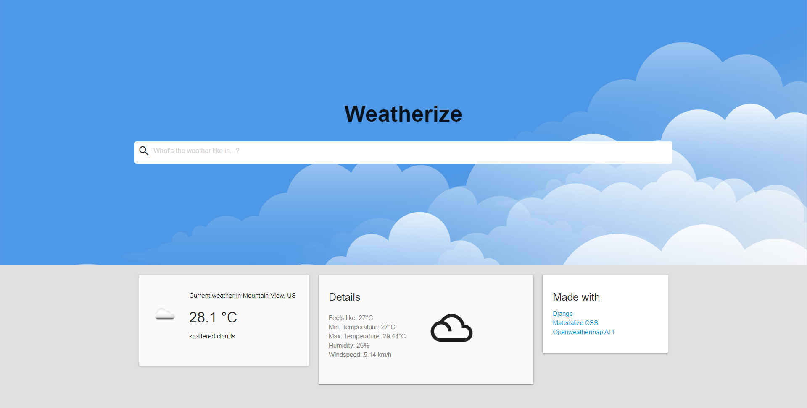

# Weatherize
Weatherize is a very simple django web-application 
for checking the current weather in a city. This web-application does not 
use any database. It simply uses the API of [Openweathermap](https://openweathermap.org/api) upon a request.

I chose Materialize CSS as CSS framework for a clean and simplistic look. 
Upon trying this web-application, you need to provide your own API KEY from 
[Openweathermap](https://openweathermap.org/api). This can easily be done by
changing `OPENWEATHERMAP_API_KEY` inside `settings.py`.



## Installation
Step 1: Cloning the repository
```bash
git clone https://github.com/kevinkosterr/django-weatherize.git django_weatherize
```

Step 2: Creating a virtual environment
```bash
cd django_weatherize
python -m virtualenv venv
```

Step 3: Activating the virtual environment
```bash
#on windows
venv\Scripts\activate
#on linux
source .\venv\bin\activate
```

Step 4: Installing the requirements
```bash
pip install -r requirements.txt
```

Step 5: Configuring the web-application (`settings.py`)
```python
.......
SECRET_KEY = "YOUR_SECRET_KEY"
.......
ACCUWEATHER_API_KEY = "YOUR_API_KEY"
......
```

Step 6: You're all set!

## Used in this project:
- [Django](https://www.djangoproject.com/) (obviously)
- [Materialize CSS](https://materializecss.com)
- [Openweathermap API](https://openweathermap.org/api)
